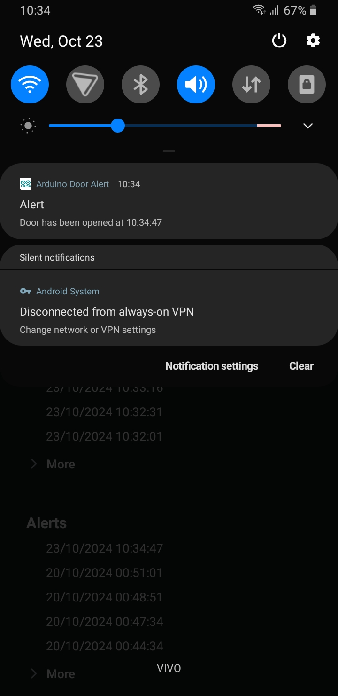

# Arduino Door Alert System

## Arquitetura

O sistema de alarme de porta é composto com um Arduino que se comunica com a API feita em Node. A API, por sua vez, se comunica com o aplicativo Android e com o serviço de notificações Firebase.

## Aplicativo Android

## Diagrama do protótipo

## Protótipos

 

